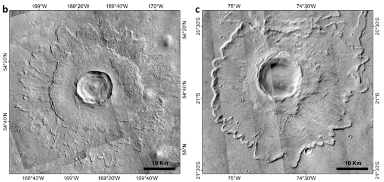
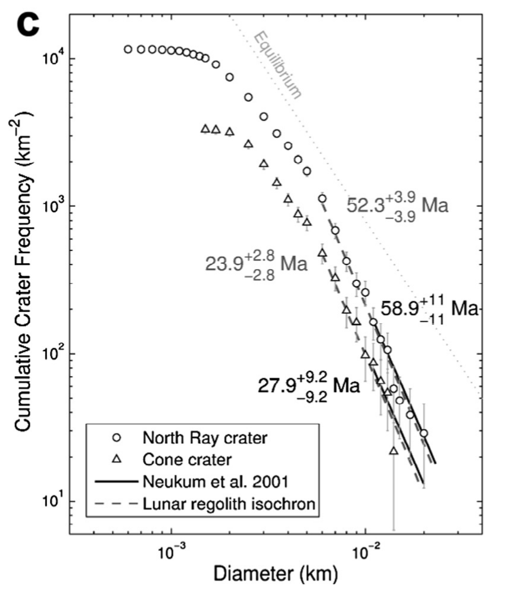
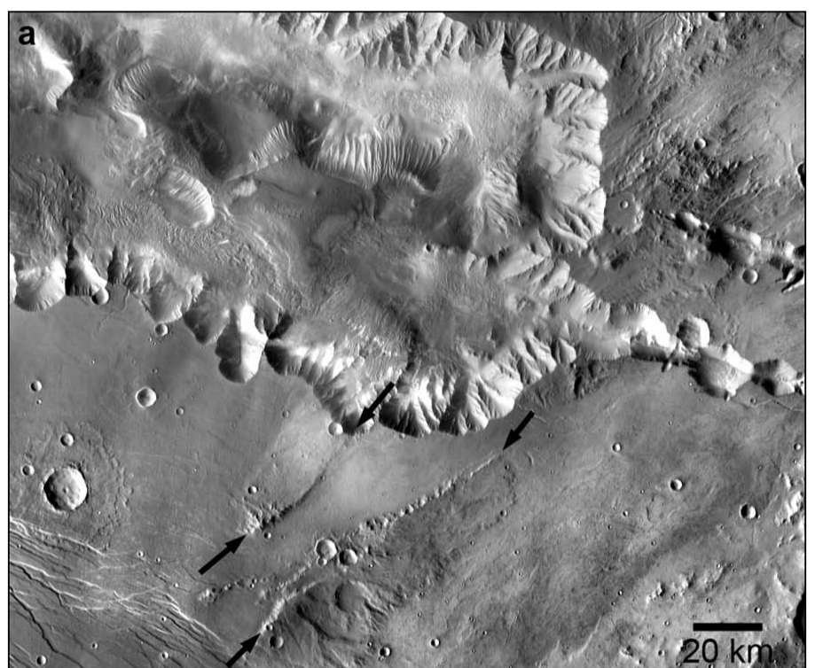
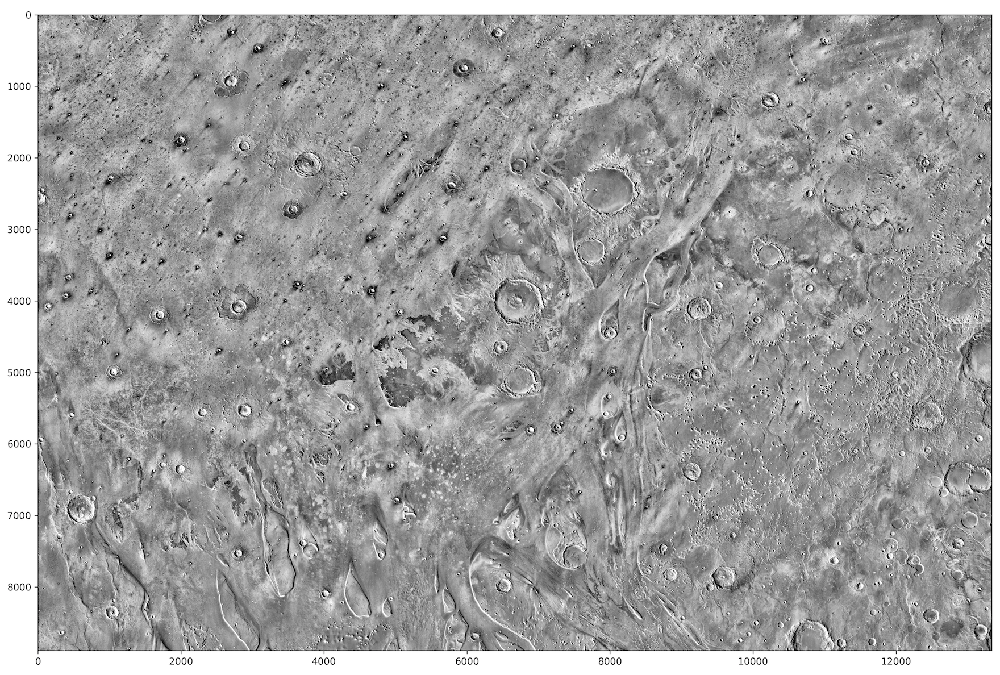
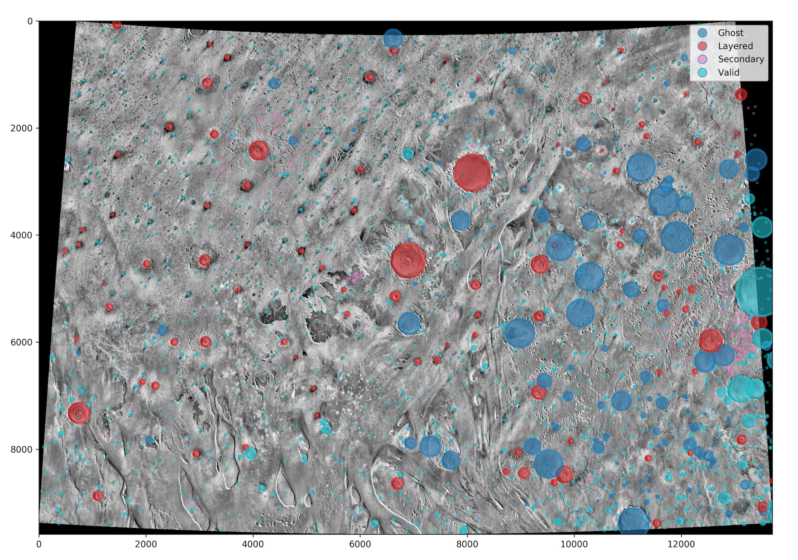
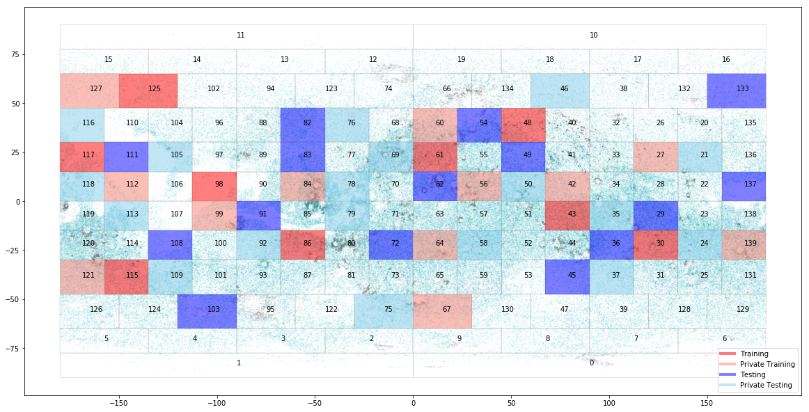
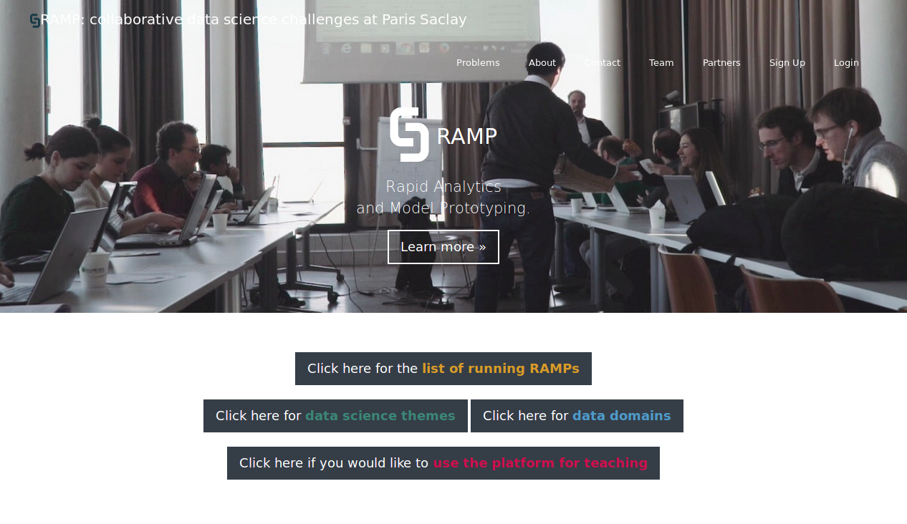
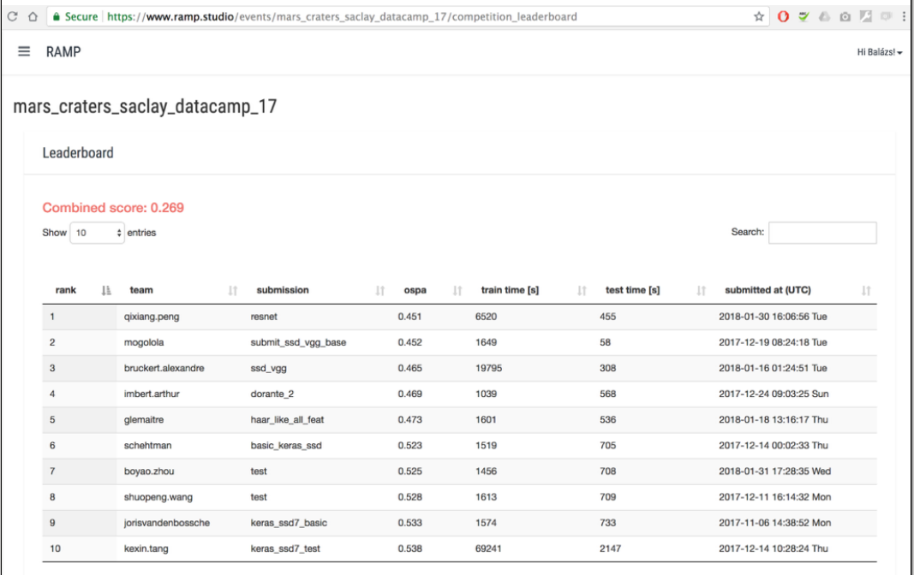

name: inverse
layout: true
class: underscore
---
class: center, middle

.title[
  ## Automated detection of planetary craters: open and reproducible benchmark platform for the Martian surface

  #### EPSC 2018 - 19 September 2018
]

**Joris Van den Bossche**, Alexandre Boucaud, **Frédéric Schmidt**, Guillaume Lemaitre, Anthony Lagain, Alina Meresescu and Balázs Kégl

.medium[joris.van-den-bossche@inria.fr, frederic.schmidt@u-psud.fr]

???

Speaker notes go after ???

Toggle speaker view by pressing P

Pressing C clones the slideshow view,
which is the view to put on the projector
if you're using speaker view.

Press ? to toggle keyboard commands help.

---

## Why automated crater detection?

<table class="layout-table" border=0 style="text-align:left; padding=0">
  <col style="width:50%">
  <col style="width:40%">
  <tr>
    <td><ul><li>Geomorphology (primary/secondary, lobate ejecta)</li></ul></td>
    <td style="padding:0; text-align:center;"></td>
  </tr>
  <tr>
    <td><ul><li>Density => datation</li></ul></td>
    <td style="padding:0; text-align:center;"></td>
  </tr>
   <tr>
    <td><ul><li>Mars is a complex body (volcanism, tectonism, ice, ...)</li></ul></td>
    <td style="padding:0; text-align:center;"></td>
  </tr>
</table>

---

## Previous attempts

Urbach et al., Planetary and Space Science, 57, 7, 880– 887, 2009.   
Salamuniccar et al., IEEE Transactions on Geoscience and Remote Sensing, , 48, 2317–2329, 2010.   
Bandeira et al., ,IEEE Transactions on Geoscience and Remote Sensing, 45, 12, 4008–4015, 2007.   
Martins et al., IEEE Geoscience and Remote Sensing Letters, 6, 1, 127–131, 2009.   
Kim et al., Photogrammetric Engineering & Remote Sensing, 71, 10, 1205–1217, 2005.   
Chen et al., IEEE Transactions on Geoscience and Remote Sensing, 1–12, 2018.   
....

 
    
* Different methods: image processing, machine learning, deep learning, ...

* Limitations: not the full body dataset, different metrics, ...

* How to compare algorithms?

---

## Open and reproducible benchmark framework

We propose an open framework allowing for fair and reproducible comparison between crater detection methods:

* Evaluation framework

    * Image data
    * Ground truth catalogue
    * Testing methodology
    * Performance measures
    
* Integrated within computing platform (RAMP)

---

## Image data

Global THEMIS data: day-time infrared image, 100m/pixel

.center[]

.right[*(Edwards et al., 2011)*]

---
count: false

## Image data

Global THEMIS data: day-time infrared image, 100m/pixel

Processing:

* Local reprojection
* Tiling (224x224 images) with overlap
* Downsampling 

---

## Ground-truth catalogue

Database based on Robbins *et al.* (2012), verified by human operation (Lagain et al., 2018, submitted)

=> 376,439 craters (> 1km)

.center[

]

---

## Testing methodology

* Independent training and hold-out testing data
* Cross-validation applied to training data

.center[

]

---

## Performance measures

Model input:
- many patches of 224x224
- list of craters (x, y, radius) for each patch

Model output:
- list of craters (conf, x, y, radius) for each patch - **not necessarily the same length as input**

---

## Performance measures

Similarity criterion between predicted and true craters:
- Intersection-over-Union (IoU)
- Best match computed using Hungarian method

.center[]
.center[]

Performance metric: precision / recall

---

## Performance measures

**Precision**: number of correctly predicted craters / number of all predicted craters

**Recall**: number of correctly predicted craters / number of true craters

**Average precision** ~ area under the precision-recall curve

---

## RAMP as benchmark platform

RAMP (Rapid Analytics and Model Prototyping) platform

.center[]

---

## RAMP as benchmark platform

RAMP (Rapid Analytics and Model Prototyping) platform

* platform for development of open source, collaborative and reproducible solutions

* focus on problem definition

* code submission (Python)

* used in e.g. data challenges and teaching

---

## Example of RAMP data challenge

.center[]

https://paris-saclay-cds.github.io/autism_challenge/

---

## Example of RAMP data challenge

Mars craters detection used in a master course

.center[]

---

## RAMP as benchmark platform

Mars craters detection - in practice:

* Getting started (downloading data, base line submission): https://github.com/ramp-kits/mars_craters

* Notebook with background information: https://github.com/ramp-kits/mars_craters/blob/master/mars_craters_starting_kit.ipynb

* https://ramp.studio/events/mars_craters_benchmark

---
class: center, middle

## Questions? Interested?

Contact:  
joris.van-den-bossche@inria.fr, frederic.schmidt@u-psud.fr

https://github.com/ramp-kits/mars_craters

---

